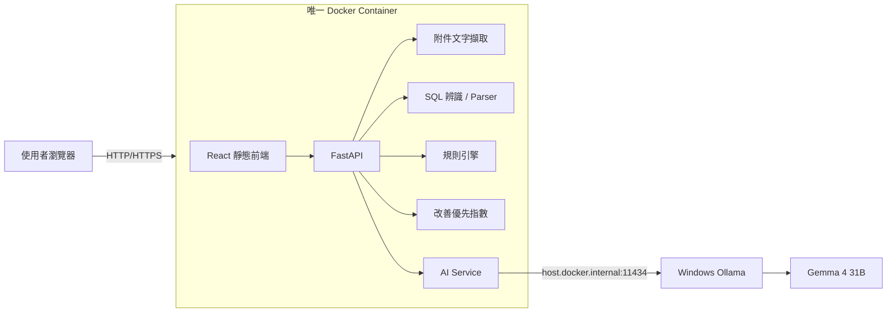
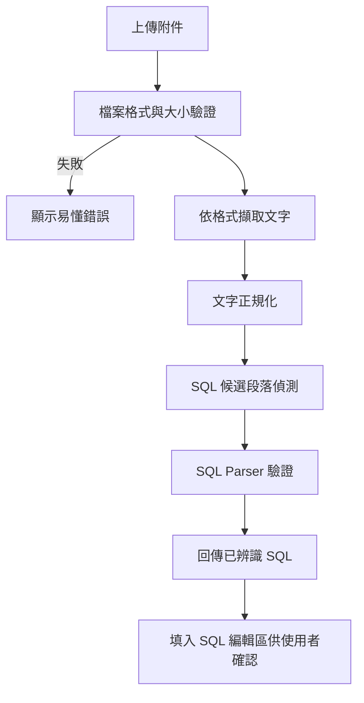

> **文件狀態：HISTORICAL / 歷史基線**  
> 本檔為早期 v6 Draft PRD，保留供追溯初始需求；它已包含多項被後續決策取代的內容，例如「改善優先指數」、AI 改善百分比與完全 stateless 的描述。  
> **目前系統行為請以現行程式碼／config、`AGENTS.md`、`SQLCheck2_系統架構與設計簡易說明.md` 與 `docs/document-status.md` 為準。請勿用本文件覆蓋較新的 owner 決策。**

# SQLCheck 2.0 智慧 SQL 效能檢核系統 — 詳細產品需求文件（PRD）

> 文件版本：v6.0 Draft  
> 文件用途：提供後續 Coding Agent、系統分析、前後端開發、測試、部署與驗收使用。  
> 專案型態：既有 SQLCheck 無原始碼可承接，採全新重建。  
> 部署環境：Windows 11 工作站 + NVIDIA RTX 4090 24GB + Windows 原生 Ollama + Gemma 4 31B + Docker Desktop。  
> 容器數量：**僅 1 個 SQLCheck App Container**；Ollama 不放入 Docker。  
> 資料保存：**Stateless、無應用資料庫、不保存歷史案件。**  
> 資料庫連線：**SQLCheck 2.0 不連線財政資訊中心 Oracle 資料庫，也不取得 Execution Plan、Index Metadata 或任何資料庫內容。**  
> 核心原則：**規則引擎負責確定性檢核；AI 負責白話解釋、改善建議、建議寫法與「預估效能改善幅度」；COST 僅由使用者第一次輸入；系統不要求第二次輸入 COST。**

---

# 0. Coding Agent 必須先理解的產品決策

本章為最高優先級產品約束。後續實作不得因「技術上更完整」而自行改變。

1. **SQLCheck 只有一個 Docker Container。**
2. **Ollama 安裝並執行於 Windows 11 Host，不在 Docker 內。**
3. **Gemma 4 31B 由 Windows Ollama 管理。**
4. **SQLCheck 不建立 SQLite、PostgreSQL、MySQL、Redis、Vector DB 或其他資料庫。**
5. **SQLCheck 不建立歷史案件資料檔，也不得以 JSON 檔變相建立資料庫。**
6. **SQLCheck 不連財政資訊中心 Oracle，也不向任何 Oracle 資料庫查詢 Execution Plan、資料表結構、索引、筆數或實際資料。**
7. **前端要求使用者輸入的三項主要資料為：申請單號、SQL、COST 值。**
8. SQL 太長時，使用者可上傳附件，由 Backend 擷取、辨識 SQL，再放回 SQL 編輯區供使用者確認。
9. 支援附件至少包含：`.docx`、`.pdf`、`.txt`、`.csv`、`.md`、`.sql`。
10. 第一版 PDF 僅支援可直接擷取文字的 PDF；**不做 OCR**。掃描型 PDF 應提示改用可選取文字 PDF、DOCX、TXT 或直接貼上 SQL。
11. 規則檢核與「改善優先指數」必須由程式決定，不讓 AI 自由打分。
12. 前端不得使用「風險」作為一般效能建議的主語意。
13. 量化指標正式名稱為：**改善優先指數**。
14. 改善優先指數區間固定：
    - 0–59：**目前良好**，綠色。
    - 60–79：**建議改善**，黃色。
    - 80–100：**優先改善**，紅色。
15. 改善優先指數用於排列「值得先改善的程度」，**不是違規分數、安全分數或合規分數**。
16. `TRUNC()`、條件欄位套用函數、HOU/HOUT 類重要資料表查詢等，本版以**提醒／改善建議**呈現，不得因單一提醒自動判成不符合。
17. 是否「不符合中心規範」只能由明確設定為 `BLOCK` 的 deterministic 規則產生。
18. `BLOCK`、`NOTICE` 等規則類型必須放在設定檔，不得散落寫死於 UI。
19. AI 不得直接覆寫原 SQL。
20. AI 所提出的 SQL 一律稱為**建議寫法**，不使用 Candidate SQL 作為一般使用者 UI 用語。
21. AI **不得產生或捏造改善後 Oracle COST 數值**；但可以依 SQL 結構、規則檢核結果、原始 COST 與建議改寫內容，提供「**預估效能改善幅度（百分比）**」。
22. 使用者只需輸入一次原始 COST；結果頁**不得要求第二次輸入或回填 COST**。
23. 改善前後比較區改為「**預估改善效果**」：以單一、直觀的百分比視覺化呈現，例如「AI 預估效能改善幅度 45%」，不得再顯示改善後 COST 輸入欄位。
24. 移除獨立的「改寫結果確認」區塊。
25. 移除獨立的「資料庫查詢方式摘要」區塊；相關白話觀察統一併入**智慧改善建議**。
26. UI 只顯示 SQL 撰寫者需要知道的內容；模型名稱、Container、Ollama、Prompt、網路架構等開發資訊不得出現在一般使用者頁面。
27. SQLCheck 的正式紀錄保存仍由既有 SPM／電子簽核流程負責。
28. 若需求不明確，Coding Agent 優先採取：**更簡單、更保守、更容易維護、更少元件**的方案。

---

# 1. 專案背景

本機關現有 SQL 效能檢核流程，目的在於協助同仁在執行自撰 SQL 前先確認是否符合既有管理規範，並降低不當 SQL 對地方稅資料庫平台效能與穩定性造成的影響。

既有管理要求與檢核概念包含：

- SQL COST 原則應小於 100,000。
- SQL 應具備適當 WHERE 條件。
- 不應使用 Parallel Hint。
- LIKE 條件應避免前置 `%`。
- 條件欄位應避免不必要的函數或運算。
- OR 條件應適度使用。
- 特定重要資料表應特別留意查詢範圍與操作方式。
- 重要資料表之高風險異動或禁止操作仍依中心明文規範處理。

SQLCheck 2.0 不是重新實作資料庫 DBA 工具，而是把原有「SQL 事前檢核」做得更容易理解、更容易改善。

---

# 2. 產品定位

SQLCheck 2.0 定位為：

> **地方稅自撰 SQL 的「規範檢核 + 改善優先指數 + 智慧改善建議 + 建議寫法對照」工具。**

系統應協助一般同仁快速回答四件事：

1. 這支 SQL 是否符合目前已設定的中心規範？
2. 哪些地方值得優先改善？
3. 可以怎麼改得更簡單、清楚或更有機會降低 COST？
4. AI 是否能提供一份保守的建議寫法供人工參考？

系統不是：

- Oracle DBA 自動化平台。
- Execution Plan 分析平台。
- 正式資料庫連線工具。
- SQL 自動執行平台。
- SQL 自動部署平台。
- AI 自主 Agent。
- 歷史案件管理系統。
- 文件管理系統。
- 稽核資料庫。

---

# 3. 第一性原理

系統設計優先順序固定為：

> **正確性 > 規範符合 > 可理解性 > 穩定性 > 效能改善**

因此：

- COST 較低，只表示值得進一步確認，不代表執行時間一定更短。
- AI 提出建議寫法，不代表 SQL 已經被正式驗證。
- 系統沒有連資料庫，因此不能聲稱「已使用索引」、「已避免 Full Table Scan」或「已證明結果一致」。
- AI 不知道實際資料分布、索引狀況、統計資訊與 Execution Plan，因此 AI 的文字必須使用「建議」、「可評估」、「可嘗試」等語意。
- 無法確定安全改寫時，寧可只給改善方向，不強行產生建議 SQL。

核心原則：

> **寧可少改，也不能為了漂亮的 COST 數字而把 SQL 意思改掉。**

---

# 4. 最終部署架構

## 4.1 實體環境

同一台 Windows 11 工作站：

- Windows 11。
- NVIDIA RTX 4090 24GB。
- Ollama：Windows 原生程式。
- Gemma 4 31B：由 Windows Ollama 載入。
- Docker Desktop：Windows 上執行。
- SQLCheck：只建立 1 個 App Container。

## 4.2 邏輯架構



## 4.3 明確不存在的連線

```text
SQLCheck  ─X─> 財政資訊中心 Oracle
Gemma     ─X─> 財政資訊中心 Oracle
Browser   ─X─> Ollama
Browser   ─X─> Oracle
```

系統不需要任何 Oracle 帳密、DSN 或資料庫 Client 設定。

---

# 5. 單一 Container 原則

正式環境只維護：

```text
sqlcheck-app
```

Container 內包含：

- FastAPI。
- React build 後的靜態檔。
- SQL Parser。
- 附件文字擷取模組。
- deterministic 規則引擎。
- 改善優先指數計算。
- Ollama Client。
- Print-friendly 前端。

不放入：

- Ollama。
- Gemma 權重。
- SQLite。
- PostgreSQL。
- Redis。
- Nginx（MVP 不需要）。
- Node.js runtime（只在 Docker build stage 使用）。

---

# 6. Stateless / 無資料庫設計

## 6.1 不建立任何案件資料庫

不使用：

- SQLite。
- PostgreSQL。
- MySQL。
- SQL Server。
- Redis。
- Vector DB。
- JSON history folder。

## 6.2 單次資料生命週期

```text
使用者輸入或上傳附件
        ↓
Backend 暫時處理
        ↓
回傳檢核結果
        ↓
瀏覽器顯示
        ↓
使用者列印 / 存成 PDF
        ↓
頁面關閉或重新整理後資料消失
```

## 6.3 禁止持久化的內容

不得將下列內容寫入永久儲存：

- 申請單號。
- 原始 SQL。
- 上傳附件原檔。
- 擷取出的 SQL。
- COST。
- AI 建議。
- 建議寫法。

前端亦不得使用：

- LocalStorage。
- IndexedDB。
- 持久化 SessionStorage。

暫時性的 React state 可以使用。

---

# 7. 使用者與主要使用情境

## 7.1 主要使用者

一般 SQL 撰寫同仁。

不假設使用者具有 DBA、Oracle Optimizer 或 Execution Plan 背景。

## 7.2 主要操作情境

### 情境 A：直接貼 SQL

1. 輸入申請單號。
2. 輸入 COST。
3. 在 SQL 編輯區貼上 SQL。
4. 按「開始檢核」。
5. 查看規範結果、改善優先指數與智慧改善建議。
6. 若有建議寫法，可複製後至既有工具重新取得 COST。
7. 查看 AI 預估的效能改善幅度，以百分比作為參考。
8. 使用瀏覽器列印／存成 PDF。

### 情境 B：SQL 太長，改用附件

1. 輸入申請單號。
2. 輸入 COST。
3. 點「上傳附件辨識 SQL」。
4. 選擇 DOCX / PDF / TXT / CSV / MD / SQL。
5. Backend 擷取文字並辨識 SQL。
6. 系統把辨識結果放回 SQL 編輯區。
7. 使用者確認、必要時修正。
8. 按「開始檢核」。

附件上傳是「協助填入 SQL」的替代方式，不是案件附件管理功能。

---

# 8. 首頁輸入欄位

首頁／左側操作區的必填資料固定為三項：

## 8.1 申請單號

- 必填。
- 文字欄位。
- 建議最大 50 字元。
- 不推測格式，不硬寫死年度碼規則。
- 只用於本次畫面與列印報告。
- 不保存。

## 8.2 SQL

- 必填。
- 多行 SQL 編輯區。
- 可直接貼上。
- 可由附件辨識結果自動填入。
- 附件辨識後仍允許使用者人工修正。
- 不要在上傳後直接跳過人工確認。

## 8.3 COST 值

- 必填。
- 由使用者從既有檢核工具／既有作業取得。
- 系統不自行查資料庫。
- 接受 `68420` 或 `68,420`。
- Backend 正規化成非負整數。
- 小於 0、非數字、空白應顯示欄位錯誤。

## 8.4 附件上傳

附件不是第四個必填欄位，而是 SQL 欄位的輔助輸入方式。

UI 文案建議：

> SQL 太長？可上傳附件自動辨識

---

# 9. 附件支援規格

## 9.1 MVP 支援格式

| 格式 | 副檔名 | 處理方式 |
|---|---|---|
| 純文字 | `.txt` | 直接讀取文字 |
| SQL | `.sql` | 直接讀取文字 |
| Markdown | `.md`, `.markdown` | 優先辨識 SQL code fence，再辨識一般文字 |
| CSV | `.csv` | 讀取所有儲存格文字後辨識 SQL |
| Word | `.docx` | 擷取段落與表格儲存格文字 |
| PDF | `.pdf` | 擷取可選取的文字層 |

MVP 不支援：

- `.doc` 舊版 Word。
- `.docm` 巨集文件。
- 圖片 JPG/PNG。
- 掃描型 PDF OCR。
- 壓縮檔。
- Excel `.xlsx`。

後續有實際需求再擴充，不要第一版全部支援。

## 9.2 建議 Python 套件

保持套件數量最小：

- DOCX：`python-docx`
- PDF：`pypdf`
- TXT / SQL / MD：Python 標準函式庫
- CSV：Python `csv`
- 編碼：`charset-normalizer`

若後續實測發現 `pypdf` 對特定 PDF 文字擷取品質不足，再評估 PyMuPDF，不要 MVP 同時裝兩套 PDF parser。

## 9.3 檔案限制

建議設定檔控制：

```yaml
upload:
  max_file_mb: 10
  max_extracted_chars: 300000
  allowed_extensions:
    - .sql
    - .txt
    - .md
    - .markdown
    - .csv
    - .docx
    - .pdf
```

實際數字可依環境調整，不要寫死於前端。

## 9.4 安全檢查

Backend 必須：

- 同時檢查副檔名與基本 MIME / magic signature。
- 拒絕可執行檔。
- 拒絕 `.docm`。
- 限制檔案大小。
- 限制解壓後 DOCX 內容量，避免 Zip Bomb。
- 不執行任何附件中的程式碼或巨集。
- 檔案只在 Request 處理期間存在暫存記憶體／安全暫存區，處理後立即釋放。

---

# 10. 附件文字擷取流程



## 10.1 TXT / SQL

- 嘗試 UTF-8 / UTF-8 BOM。
- 若失敗，使用 charset-normalizer。
- 臺灣舊檔可能出現 Big5 / CP950，應盡量自動辨識。

## 10.2 Markdown

優先順序：

1. fenced code block 且語言標示 `sql` / `oracle`。
2. 其他 fenced code block 內可被 SQL parser 辨識的內容。
3. 文件一般文字中的 SQL 候選段落。

Markdown 標題與說明文字不可混入最終 SQL。

## 10.3 CSV

CSV 可能有：

- 每列一段 SQL。
- 一個儲存格包含完整 SQL。
- 多欄位其中一欄為 SQL。

處理方式：

1. 解碼。
2. 讀取所有 cell。
3. 對 cell 與連續列做 SQL 候選辨識。
4. 將高可信度 SQL 合併後回傳。

不要把純數據 CSV 誤判成 SQL。

## 10.4 DOCX

依文件順序擷取：

- Paragraph。
- Table cell。

優先辨識：

- 以 `SELECT`、`WITH`、`UPDATE`、`DELETE`、`INSERT`、`MERGE` 開頭之區塊。
- 等寬字型不是必要條件。
- Word 樣式不可作為唯一判斷依據。

## 10.5 PDF

只處理有文字層的 PDF。

若：

- 每頁擷取內容為空；或
- 內容幾乎全是不可辨識字元；

顯示：

> 此 PDF 可能為掃描影像，第一版無法自動辨識。請改用可選取文字的 PDF、DOCX、TXT，或直接貼上 SQL。

不得偷偷使用低可靠 OCR 後直接送進檢核。

---

# 11. SQL 辨識與抽取

附件「有文字」不代表「文字就是 SQL」。必須有第二層 SQL 辨識。

## 11.1 辨識流程

1. 文字清理。
2. 去除明顯頁首頁尾與空白。
3. 保留 SQL 註解，但 SQL 註解不得視為系統指令。
4. 辨識 SQL statement 起始關鍵字。
5. 處理多 statement。
6. 以 `sqlglot` Oracle dialect 嘗試 parse。
7. parse 成功者提高可信度。
8. parse 不完整但具有明確 SQL 結構者，標示「部分辨識，請確認」。
9. 抽取結果永遠先回到 SQL 編輯區，使用者確認後才進正式檢核。

## 11.2 支援的 statement 類型

至少辨識：

- SELECT
- WITH ... SELECT
- UPDATE
- DELETE
- INSERT
- MERGE
- PL/SQL `DECLARE` / `BEGIN`
- SQL*Plus 指令（只辨識並與 SQL 分開）

## 11.3 多段 SQL

如果辨識出多段 SQL：

前端顯示：

> 已辨識 3 段 SQL，請確認內容後再開始檢核。

MVP 可以將多段 SQL 保留於同一編輯區，Backend 逐段解析，再回傳整體摘要與逐段 findings。

不要自動只取第一段而丟掉其他 SQL。

## 11.4 SQL 判斷可信度

Backend 可內部產生：

- `high`
- `medium`
- `low`

但前端不需要顯示技術分數。

前端只需要：

- 「已辨識 SQL」
- 「部分內容需確認」
- 「未辨識到 SQL」

---

# 12. SQL Parser

建議：

```text
sqlglot (Oracle dialect)
```

Parser 目的不是把 SQL 改寫，而是讓規則判定不要依賴粗糙 Regex。

Parser 應協助判斷：

- Statement type。
- Tables。
- WHERE 是否存在。
- OR expression。
- LIKE expression。
- Function call。
- Hint。
- SELECT columns。
- Join structure。
- Aggregate / DISTINCT / GROUP BY。
- Set operations。

Regex 僅可做輔助，不可作為複雜 SQL 的唯一判斷。

---

# 13. 規則引擎設計

## 13.1 原則

規則引擎是 deterministic。

Gemma 不負責決定：

- COST 是否超標。
- WHERE 是否存在。
- Parallel Hint 是否存在。
- OR 是否存在。
- TRUNC 是否存在。
- 重要資料表名稱是否出現。

## 13.2 規則狀態

每項 rule 回傳：

```text
PASS      符合
NOTICE    提醒
BLOCK     不符合
REVIEW    需要人工確認
N/A       不適用
```

UI 文字：

- PASS → `符合`
- NOTICE → `提醒`
- BLOCK → `不符合`
- REVIEW → `請確認`
- N/A → 不顯示或灰色

## 13.3 BLOCK 與 NOTICE 分離

只有設定檔明確標示 `BLOCK` 的規則可以影響「中心規範」總判定。

例如第一版預設建議：

| 規則 | 預設類型 | 說明 |
|---|---|---|
| COST >= 100000 | BLOCK | 明確門檻 |
| 缺少 WHERE（適用 Statement） | BLOCK | 依中心規範 |
| Parallel Hint | BLOCK | 禁止使用 |
| 明文禁止之重要資料表操作 | BLOCK | 以設定檔名單為準 |
| `TRUNC(column)` | NOTICE | 改善提醒 |
| 一般函數作用於條件欄位 | NOTICE | 改善提醒 |
| OR | NOTICE | 改善提醒 |
| LIKE 前置 `%` | NOTICE（待業務確認可調） | 不直接因單一條件阻擋 |
| HOU / HOUT 等指定重要表查詢 | NOTICE | 提醒縮小查詢範圍 |

以上 mapping 必須放在 `rules.yaml`，日後可調，不得在 React component 裡寫死。

---

# 14. 不再依賴資料庫資訊的規則調整

因本系統不連 Oracle，以下內容**不得在系統中做肯定判定**：

- 是否真正使用 Index。
- 是否真正發生 Full Table Scan。
- Execution Plan Operation。
- Cardinality。
- Buffer Gets。
- Physical Reads。
- 實際 Rows。
- Table 統計資訊。
- Index 是否存在。
- SQL 實際執行時間。

因此原先類似：

> 「這段 SQL 沒有使用索引」

必須改為：

> 「這種條件寫法可能較不利於既有索引發揮效果，可評估調整。」

原先類似：

> 「HOUT120 發生 Full Table Scan」

若沒有使用者提供其他證據，不可顯示。

應改為：

> 「此 SQL 查詢 HOUT120，建議確認條件範圍是否足夠明確，避免一次讀取過多資料。」

---

# 15. 中心規範總判定

總判定只看 deterministic `BLOCK` findings。

### 若沒有 BLOCK

顯示：

> **符合中心規範**

即使存在多項 NOTICE，也不因此變成「不符合」。

### 若有 BLOCK

顯示：

> **不符合中心規範**

並在規則列表清楚指出是哪一項。

### 若 Parser 無法可靠判斷關鍵規則

顯示：

> **請人工確認**

不得亂判 PASS。

---

# 16. 改善優先指數 — 正式語意

原「效能風險／風險分數」全部取消。

正式名稱：

> **改善優先指數**

目的：

> 量化「這支 SQL 有多少地方值得優先檢視與改善」。

它不是：

- 違規分數。
- 風險分數。
- 安全分數。
- SQL 品質成績。

## 16.1 固定區間

| 指數 | 顯示 | 顏色 | 使用者語意 |
|---:|---|---|---|
| 0–59 | 目前良好 | 綠 | 暫無需要優先處理的明顯項目 |
| 60–79 | 建議改善 | 黃 | 有幾項值得優先檢視 |
| 80–100 | 優先改善 | 紅 | 建議先調整後再進行後續作業 |

## 16.2 UI 顯示方式

上方 Summary Card 合併顯示：

```text
改善優先指數
68 / 100
建議改善
```

小字：

> 分數越高，代表值得優先檢視的項目越多

不要出現「中風險」「高風險」。

## 16.3 分數計算

門檻已確定，但各 rule 的加權分數尚須後續業務確認。

Coding Agent 必須做成設定：

```yaml
improvement_score:
  max_score: 100
  levels:
    good:
      max: 59
    improve:
      min: 60
      max: 79
    priority:
      min: 80

weights:
  cost_near_threshold: 0
  function_on_condition: 0
  leading_wildcard_like: 0
  or_condition: 0
  important_table_notice: 0
```

在正式權重未定案前：

- Prototype 可用示意分數。
- Production 不得由 Coding Agent 自行臆測權重後宣稱正式。

---

# 17. COST 與 AI 預估改善幅度

## 17.1 原始 COST

原始 COST 由使用者在首頁輸入一次。

Backend 處理：

- 去除逗號與空白。
- 解析為整數。
- 必須 >= 0。
- 此值只作為規則檢核與 AI 分析的上下文之一。

## 17.2 COST 規範

當：

```text
COST >= 100000
```

依目前規範設定為 BLOCK。

UI 顯示範例：

```text
COST
68,420
低於規範門檻 100,000
```

或：

```text
COST
125,320
超過規範門檻
```

## 17.3 不計算「改善後 Oracle COST」

SQLCheck 2.0 不連 Oracle，因此系統與 AI 均不得宣稱可以算出真正的改善後 Oracle COST。

禁止輸出：

```text
改善後 COST = 19,160
```

或：

```text
建議寫法 COST 會從 68,420 降到 19,160
```

因為這類數字需要 Oracle Optimizer 與實際資料庫統計資訊才能取得。

## 17.4 AI 可以輸出「預估效能改善幅度」

為了讓一般同仁快速理解建議改寫可能帶來的效益，Gemma 4 可以根據下列資訊做**啟發式預估**：

- 原始 SQL 結構。
- 使用者輸入的原始 COST。
- deterministic 規則檢核結果。
- 已偵測到的改善點，例如欄位函數、前置 `%`、OR、查詢範圍等。
- AI 自己提出的建議寫法。

AI 僅回傳：

```json
{
  "estimated_improvement_pct": 45
}
```

意義為：

> **AI 預估此建議寫法可能帶來約 45% 的效能改善幅度。**

這個百分比是輔助參考，不是 Oracle 實測值，也不是新的 COST。

## 17.5 百分比呈現原則

為避免製造不必要的精確感：

- Backend 將 AI 回傳值限制在 `0–100`。
- UI 顯示整數百分比。
- 建議將 AI 原始值四捨五入至最接近的 5%，例如 43% 顯示為 45%。
- 不另外要求使用者輸入第二次 COST。
- 不在畫面推算「改善後 COST」。
- 不以百分比作為中心規範合規判定依據。

若 AI 無法合理評估，允許回傳：

```json
{
  "estimated_improvement_pct": null
}
```

UI 顯示：

> **本次不提供效能改善幅度預估**

這比強行給一個數字更好。

---

# 18. 預估改善效果

本區取代舊版「改善前後 COST 比較」。

## 18.1 使用者不需要第二次操作

使用者只需要在檢核前輸入一次：

- 申請單號。
- SQL。
- 原始 COST。

系統完成分析後，直接顯示 AI 的預估改善比例。

不提供：

- 改善後 COST 輸入框。
- 第二次 COST 回填。
- 改善後 COST 計算。
- COST 差額計算。

## 18.2 主視覺

建議以單一大型視覺化元件呈現：

```text
預估改善效果

      45%
 AI 預估效能改善幅度
```

視覺形式可採：

- 圓形進度環。
- 半圓 Gauge。
- 大型百分比數字搭配極簡進度環。

不要使用兩個 COST 長條做前後比較。

## 18.3 輔助文字

只保留一行簡短說明：

> **AI 依目前 SQL 寫法與改善建議進行預估，實際效果仍以後續執行結果為準。**

不要加入更多技術解釋。

## 18.4 顏色

此百分比表示「預估可改善幅度」，不是風險，因此顏色應表達正向改善潛力。

建議：

- 0–19%：中性灰／淡藍。
- 20–49%：藍色。
- 50%以上：綠色。

此色階僅為 UI 建議，可在後續視覺微調時調整，不列為業務規則。

---

# 19. AI 模型與角色

模型：

- Gemma 4 31B。
- Windows 原生 Ollama。
- SQLCheck Container 經 HTTP 呼叫。

AI 角色只做四件事：

## 19.1 白話解釋

把 deterministic rule findings 用臺灣繁體中文說明。

## 19.2 改善建議

說明：

- 哪裡值得留意。
- 可以怎麼簡單調整。
- 必要時給很短的 SQL 範例。

## 19.3 建議寫法

只有 Backend 允許時才產生。

## 19.4 預估效能改善幅度

AI 可依原始 SQL、原始 COST、規則檢核結果與建議寫法，回傳一個「預估效能改善幅度」百分比。

此百分比只供使用者快速判斷改善潛力，不代表 Oracle 實際 COST 或實際執行時間。

AI 不負責：

- 合規最終判定。
- 改善優先指數。
- COST 計算。
- 改善後 Oracle COST 數值預測。
- 資料庫連線。
- Execution Plan。
- Index 判定。
- 自動執行 SQL。

---

# 20. AI 輸入內容

Backend 傳給 Gemma 的內容只包含：

```json
{
  "statement_type": "SELECT",
  "sanitized_sql": "...",
  "input_cost": 68420,
  "compliance": "PASS",
  "findings": [
    {
      "rule_id": "R005",
      "level": "NOTICE",
      "fact": "TRUNC used in WHERE"
    }
  ],
  "important_table_notices": ["HOUT120"],
  "candidate_allowed": true,
  "estimate_improvement_allowed": true
}
```

AI 不需要看到：

- 模型管理資料。
- Windows 路徑。
- Container 設定。
- 任何資料庫帳密。
- 真實納稅資料。

---

# 21. SQL Literal 遮罩

若 SQL 中有明顯 literal：

```sql
WHERE IDN_BAN = 'A123456789'
```

送 AI 前：

```sql
WHERE IDN_BAN = :STR_001
```

日期、長字串、可能個資都應盡量遮罩。

原始 SQL 仍留在目前 Request 記憶體供畫面顯示，不永久保存。

---

# 22. AI 臺灣繁體中文規格

所有一般使用者文字必須使用臺灣繁體中文。

優先詞彙：

- 資料庫
- 資料表
- 欄位
- 查詢條件
- 執行成本
- COST
- 改善
- 調整
- 建議寫法
- 回傳

避免：

- 數據庫
- 字段
- 優化 SQL（UI 優先用「改善 SQL」「調整 SQL」）
- 候選 SQL
- 語意安全 Gate
- Semantic Security

必要專有術語可保留：

- SQL
- WHERE
- LIKE
- OR
- TRUNC
- Parallel Hint
- COST

---

# 23. AI 文案語氣

避免：

- 「問題」
- 「嚴重問題」
- 「錯誤寫法」
- 「高風險」

除非 deterministic 規則已明確判定 `BLOCK`，否則用：

- 提醒
- 建議
- 可以留意
- 可評估
- 可嘗試調整
- 值得優先檢視

範例：

不好：

> 你的 SQL 有嚴重索引問題。

好：

> 日期條件目前使用 `TRUNC()`，可以評估改成日期範圍寫法，讓資料庫有更多機會採用較有效率的查詢方式。

---

# 24. AI Structured Output

Ollama 應要求固定 JSON Schema。

建議：

```json
{
  "summary": "目前符合中心規範，另有 2 項改善建議。",
  "advice": [
    {
      "title": "日期條件可再簡化",
      "explanation": "目前使用 TRUNC() 比對日期，可評估改成日期範圍。",
      "example": "TXN_DATE >= :START_DATE AND TXN_DATE < :END_DATE"
    }
  ],
  "suggested_sql": {
    "available": true,
    "reason": "可提供簡單改寫供參考。",
    "sql": "SELECT ..."
  }
}
```

Backend 必須 Pydantic 驗證。

格式錯誤：

- 可重試 1 次。
- 仍失敗則顯示 deterministic 結果。
- 不從壞掉的自由文字中猜欄位。

---

# 25. 建議寫法安全限制

系統沒有資料庫可驗證，因此必須更保守。

## 25.1 Original 永遠保留

建議寫法不得覆蓋原 SQL。

UI 永遠左右／上下分開：

- 原始 SQL
- 建議寫法

## 25.2 MVP 只允許 SELECT 建議寫法

以下預設不產生完整改寫 SQL：

- UPDATE
- DELETE
- INSERT
- MERGE
- DDL
- PL/SQL block

AI 只給文字建議。

## 25.3 高複雜 SELECT 也可禁止自動建議寫法

例如：

- OUTER JOIN
- GROUP BY + aggregate
- DISTINCT
- Analytic Functions
- CONNECT BY
- UNION / MINUS / INTERSECT
- ROWNUM
- Dynamic SQL
- 複雜 correlated subquery

Backend 可設定 `candidate_allowed=false`。

## 25.4 無法安全改寫時

固定語意：

> **為避免改變原本查詢內容，本次先提供改善方向，不自動產生建議寫法。**

這比「錯誤」或「無法最佳化」更友善。

---

# 26. 智慧改善建議 — 合併後的主要區塊

原本：

- 智慧輔助建議
- 資料庫查詢方式摘要

正式合併為：

> **智慧改善建議**

本區是結果頁最重要的內容之一。

每項建議只需要回答：

### A. 可以留意什麼

例如：

> 日期條件目前使用 `TRUNC()`。

### B. 為什麼值得調整

例如：

> 這種寫法可能讓資料庫較難利用既有的查詢方式，資料量大時可能較慢。

不要宣稱「索引一定失效」。

### C. 可以怎麼改

例如：

```sql
TXN_DATE >= :起始日
AND TXN_DATE < :隔日
```

### D. 若涉及指定重要資料表

例如：

> 此 SQL 查詢 HOUT120，建議確認查詢日期與條件範圍，避免一次帶出過多資料。

不要使用沒有資料庫證據的：

> HOUT120 現在正在整表掃描。

---

# 27. UI 資訊架構

使用者只需要一個主要頁面／Dashboard。

不建立複雜多頁後台。

建議畫面順序：

```text
A. 頂部品牌列

B. SQL 輸入工作區
   - 申請單號
   - COST
   - SQL Editor
   - 上傳附件辨識 SQL
   - 開始檢核

C. 檢核結果摘要 Cards
   - 中心規範
   - COST
   - 改善優先指數（分數 + 狀態合併）
   - 改善建議數量
   - 建議寫法

D. 中心規則比對

E. 智慧改善建議
   - 同時承接原「資料庫查詢方式摘要」內容

F. 預估改善效果
   - AI 預估效能改善幅度（百分比）
   - 圓形／半圓形等簡單視覺化
   - 一行簡短註記：實際效果以後續執行結果為準

G. SQL 寫法比較
   - 原始 SQL
   - 建議寫法

H. 列印 / 存成 PDF
```

完全移除：

- 改寫結果確認 Card。
- Execution Plan Card。
- Semantic Security。
- 技術架構資訊。
- 模型名稱資訊。

---

# 28. 視覺設計方向

## 28.1 整體風格

方向：

> **Apple 式淺色、簡約、現代、留白充分、Card-based Dashboard。**

不要：

- 黑底駭客風。
- 高飽和霓虹。
- 過多漸層。
- 過多動畫。
- 一頁十幾種顏色。
- 密密麻麻的 DBA 報表。

## 28.2 字體

系統字體優先：

```css
-apple-system,
BlinkMacSystemFont,
"PingFang TC",
"Noto Sans TC",
"Microsoft JhengHei",
"Segoe UI",
sans-serif
```

字級適中：

- 頁面主標題：約 28–32px。
- Card title：約 16–18px。
- 一般內文：約 15–16px。
- 次要說明：約 12–14px。
- 大數據：約 24–32px。

不要為了「科技感」把字縮得很小。

## 28.3 字重

- 主數據：700–800。
- Section title：700。
- 一般文字：400–500。
- 輔助文字：400。

關鍵數字比大量 Bold 文句更重要。

## 28.4 色彩語意

- 綠：符合、目前良好、較高的正向改善潛力。
- 黃：提醒、建議改善。
- 紅：不符合、優先改善。
- 藍：一般資訊、COST。
- 紫：智慧改善建議。
- 灰：次要資訊、無法提供預估或不適用。

同一語意保持同色。

## 28.5 Card

Card：

- 白色或極淡底色。
- 輕邊框。
- 小幅陰影。
- 圓角約 16–24px。
- 內容留白充分。

PRD 不把精確尺寸寫死，後續可依 Prototype 微調。

---

# 29. 頂部摘要 Cards — 正式定義

建議 5 張 Card：

## Card 1 — 中心規範

範例：

```text
中心規範
符合
2 項提醒
```

## Card 2 — COST

```text
COST
68,420
低於 100,000
```

## Card 3 — 改善優先指數

將原本「效能風險 + 風險分數」合併成一張：

```text
改善優先指數
68 / 100
建議改善
```

黃底／黃 icon。

## Card 4 — 改善建議

```text
改善建議
2 項
優先看日期條件
```

## Card 5 — 建議寫法

```text
建議寫法
可供參考
```

或：

```text
建議寫法
本次不提供
```

不要顯示「Candidate」。

---

# 30. 中心規則比對區

本區強調「規則事實」，不要混入長篇 AI 文案。

建議欄位：

| 狀態 | 檢核項目 | 本次內容 | 簡短說明 |
|---|---|---|---|
| 符合 | COST | 68,420 | 低於門檻 |
| 符合 | WHERE | 已設定 | 已有限制條件 |
| 符合 | Parallel Hint | 未發現 | 符合 |
| 提醒 | 日期欄位函數 | TRUNC(TXN_DATE) | 可評估調整 |
| 提醒 | 重要資料表 | HOUT120 | 建議縮小查詢範圍 |

注意：

- 移除「只有明確觸發禁止條件，才會判定為不符合」這句 UI 說明。
- 這是內部設計原則，不必教育使用者。
- 規則判定自然透過綠／黃／紅呈現即可。

---

# 31. 智慧改善建議區 — 正式 UI

Section title：

> **智慧改善建議**

不需要副標：

> 用簡單文字說明可以留意與改善的地方

該副標正式移除。

建議使用 2–3 個簡潔的彩色資訊 Card。

範例：

### 提醒 1：日期條件可調整

> 目前使用 `TRUNC(TXN_DATE)`。如果是查詢一天的資料，可以評估改成日期範圍。

範例：

```sql
TXN_DATE >= :起始日
AND TXN_DATE < :隔日
```

### 提醒 2：查詢 HOUT120

> 建議確認日期及其他條件是否已縮小查詢範圍，避免一次讀取過多資料。

語句保持 1–3 句，避免長篇技術課程。

---

# 32. 預估改善效果區 — 正式 UI

本區的目的不是要求同仁再次驗證或輸入數字，而是讓同仁一眼理解：

> **依 AI 對 SQL 改寫的判斷，這個建議大約有多少改善潛力。**

## 32.1 主畫面

建議呈現：

```text
預估改善效果

       45%
AI 預估效能改善幅度

AI 依目前 SQL 寫法與改善建議進行預估，實際效果仍以後續執行結果為準。
```

## 32.2 視覺化

優先使用：

- 大型百分比。
- 圓形進度環或半圓 Gauge。
- 簡單的單一視覺焦點。

不要：

- 改善前 COST / 改善後 COST 雙卡。
- 第二次 COST 輸入欄位。
- COST 差額。
- 長條 Bar。
- Full Scan 前後數字。
- Index Range Scan 前後數字。
- 改善優先指數前後比較。
- 任何假裝是 Oracle 實測結果的數字。

## 32.3 百分比來源

此值來自 Gemma 4 的 structured output：

```json
{
  "estimated_improvement_pct": 45
}
```

Backend 必須：

- 驗證為數字或 null。
- clamp 在 0–100。
- 建議 round 到 5% 單位。
- 不利用此值反推出改善後 COST。

若為 null，顯示：

> 本次不提供效能改善幅度預估

---

# 33. SQL 寫法比較

本區保留：

```text
原始 SQL     |     建議寫法
```

必要功能：

- Syntax Highlight。
- 保留原 SQL。
- 建議寫法供複製。
- 可顯示簡單 Diff highlight。
- 不要在建議寫法上標示「已驗證」。

若本次不提供建議寫法：

右側顯示：

> 為避免改變原本查詢內容，本次先提供改善方向，不自動產生建議寫法。

---

# 34. 輸入工作區 UI

建議 Desktop 採：

- 左側固定／sticky 操作 Card；或
- 頂部完整輸入 Card。

目前 Prototype 可沿用左側 Sidebar，但不寫死，後續可再微調。

操作區只包含使用者需要的：

- 申請單號。
- COST。
- SQL Editor。
- 附件上傳。
- 開始檢核。
- 清除。

不要顯示：

- 模型名稱。
- Model status。
- 規則版本。
- Docker 狀態。
- Ollama URL。
- Context Window。
- GPU 資訊。

---

# 35. 附件上傳 UI

SQL Editor 下方：

```text
SQL 太長？
[ 上傳附件辨識 SQL ]
支援 DOCX、PDF、TXT、CSV、Markdown、SQL
```

上傳成功：

```text
✓ 已辨識 report.docx
已擷取 2 段 SQL，請確認內容
```

無法辨識：

```text
未辨識到可檢核的 SQL，請確認附件內容或直接貼上 SQL。
```

掃描 PDF：

```text
此 PDF 無法擷取文字，請改用可選取文字的 PDF、DOCX、TXT，或直接貼上 SQL。
```

---

# 36. Responsive

Desktop 為主要環境，但至少支援：

- 1366×768。
- 1920×1080。
- 2560×1440。

窄畫面：

- Sidebar 變成上方 Input Card。
- Summary 由 5 欄改為 2 欄或 1 欄。
- SQL Compare 由左右改為上下。
- 不產生整頁水平捲軸。

---

# 37. 列印 / PDF

系統無資料庫，所以報告採瀏覽器：

```text
window.print()
```

配合 `@media print`。

列印版包含：

- 系統名稱。
- 申請單號。
- 原始 COST。
- 中心規範判定。
- 改善優先指數。
- 規則比對。
- 智慧改善建議。
- 原始 SQL。
- 建議寫法（若有）。
- AI 預估效能改善幅度。

列印版不需要：

- 上傳按鈕。
- 輸入欄位。
- 開始檢核按鈕。
- 清除按鈕。

檔名無法由 `window.print()` 保證自動設定，但畫面可提示建議以申請單號命名 PDF。

---

# 38. 前端技術方案

## 38.1 開發

- Node.js LTS。
- React。
- TypeScript。
- Vite。
- Tailwind CSS。
- Monaco Editor 或 CodeMirror 6。

兩者選一即可，不要同時裝。

若 Monaco 體積或 Docker build 複雜度不必要，可改 CodeMirror 6；以「維護簡單」為優先。

## 38.2 正式 Runtime

Node.js 只做 build。

正式 App Container 不執行 Node server。

```text
npm ci
npm run build
       ↓
dist/
       ↓
FastAPI 靜態服務
```

---

# 39. Backend 技術方案

- Python 3.12。
- uv。
- FastAPI。
- Pydantic。
- httpx。
- sqlglot。
- PyYAML。
- python-docx。
- pypdf。
- charset-normalizer。

不要加入：

- SQLAlchemy。
- Alembic。
- python-oracledb。
- LangChain。
- LangGraph。
- Celery。
- Redis client。

因本版不需要。

---

# 40. 最小 API 設計

系統可縮到三個 endpoint。

## GET `/api/health`

用途：App 健康檢查。

回傳：

```json
{
  "status": "ok",
  "ai_available": true
}
```

一般 UI 不必顯示模型名稱。

## POST `/api/extract-sql`

`multipart/form-data`

輸入：

```text
file
```

回傳：

```json
{
  "status": "ok",
  "filename": "report.docx",
  "sql": "SELECT ...",
  "statement_count": 2,
  "needs_confirmation": true,
  "message": "已辨識 2 段 SQL，請確認內容。"
}
```

不保存檔案。

## POST `/api/analyze`

輸入：

```json
{
  "application_no": "115000218",
  "cost": 68420,
  "sql": "SELECT ..."
}
```

回傳：

```json
{
  "compliance": {
    "status": "PASS",
    "label": "符合中心規範"
  },
  "cost": 68420,
  "improvement": {
    "score": 68,
    "level": "IMPROVE",
    "label": "建議改善"
  },
  "findings": [],
  "ai": {
    "summary": "...",
    "advice": [],
    "suggested_sql": {},
    "estimated_improvement_pct": 45
  }
}
```

不需要建立案件 ID，因為沒有資料庫。

---

# 41. Frontend State

使用 React local state 即可。

主要狀態：

```text
applicationNo
cost
sql
uploadState
analysisResult
estimatedImprovementPct
loading
error
```

不需要 Redux。

不需要 Zustand。

不需要 persistent cache。

若引入 TanStack Query 沒有明確收益，MVP 直接 `fetch()` 即可。

---

# 42. Backend 模組切分

保持平坦，不使用過度 DDD。

```text
backend/
└── app/
    ├── main.py
    ├── api.py
    ├── schemas.py
    ├── services/
    │   ├── file_extract.py
    │   ├── sql_detect.py
    │   ├── sql_parser.py
    │   ├── rule_engine.py
    │   ├── improvement_score.py
    │   ├── masking.py
    │   └── ai_service.py
    ├── config/
    │   ├── rules.yaml
    │   ├── important_tables.yaml
    │   └── app.yaml
    └── prompts/
        └── sql_review_zh_tw.txt
```

不要為每個 function 建十層 interface。

---

# 43. Frontend 模組切分

```text
frontend/
└── src/
    ├── App.tsx
    ├── components/
    │   ├── InputPanel.tsx
    │   ├── FileUpload.tsx
    │   ├── SqlEditor.tsx
    │   ├── SummaryCards.tsx
    │   ├── ComplianceTable.tsx
    │   ├── ImprovementAdvice.tsx
    │   ├── CostCompare.tsx
    │   └── SqlCompare.tsx
    ├── api/
    │   └── client.ts
    ├── types/
    │   └── api.ts
    └── styles/
        └── print.css
```

---

# 44. 規則設定檔

範例：

```yaml
rules:
  - id: R001
    name: COST
    type: block
    enabled: true
    threshold: 100000

  - id: R002
    name: WHERE 查詢條件
    type: block
    enabled: true

  - id: R003
    name: Parallel Hint
    type: block
    enabled: true

  - id: R004
    name: LIKE 前置百分比
    type: notice
    enabled: true

  - id: R005
    name: 條件欄位使用函數
    type: notice
    enabled: true

  - id: R006
    name: OR 條件
    type: notice
    enabled: true

  - id: R007
    name: 重要資料表
    type: notice
    enabled: true
```

業務規則更新時盡量改 YAML，而非改 UI code。

---

# 45. 重要資料表設定

```yaml
important_tables:
  - name: WIIT001
    message: 請特別確認查詢範圍與必要性。

  - pattern: "HOU*"
    message: 請確認查詢條件範圍，避免一次讀取過多資料。
```

實際清單由業務端提供。

不可讓 AI 自己決定哪些 Table 是重要表。

---

# 46. Ollama 連線

SQLCheck Container：

```text
http://host.docker.internal:11434
```

建議環境變數：

```env
OLLAMA_BASE_URL=http://host.docker.internal:11434
OLLAMA_MODEL=gemma4:31b-it-qat
OLLAMA_TIMEOUT_SECONDS=120
OLLAMA_NUM_CTX=8192
```

注意：

Windows Ollama 必須允許 Docker Desktop Host Gateway 連入，但 Windows Firewall 應限制 11434 不對一般區網任意開放。

瀏覽器絕對不直接打 11434。

---

# 47. Gemma Prompt 核心

```text
你是臺灣地方稅務機關的 SQL 效能檢核助理。

你只能根據系統提供的 SQL、COST 與規則檢核結果提出說明。
系統未連線資料庫，因此你不知道實際 Execution Plan、Index、資料量與執行時間。
不得虛構這些資訊。

請使用臺灣繁體中文，以一般非 DBA 同仁可以理解的方式：
1. 說明值得留意的地方。
2. 提供簡單改善方向。
3. 只有 candidate_allowed=true 時才提供建議 SQL。

不要使用「高風險」「嚴重問題」等語句，除非系統明確提供 BLOCK 結果。
不要把較低 COST 視為一定比較快。
不要產生或推算改善後 Oracle COST 數值；只可在允許時提供「預估效能改善幅度」百分比。
無法確認安全改寫時，不要強行改寫。
```

---

# 48. Dockerfile Best Practice

使用 multi-stage build。

概念：

```dockerfile
# Stage 1: Frontend build
FROM node:<LTS> AS frontend-build
WORKDIR /src/frontend
COPY frontend/package*.json ./
RUN npm ci
COPY frontend/ ./
RUN npm run build

# Stage 2: Python runtime
FROM python:3.12-slim
# 安裝 uv
# uv sync --frozen --no-dev
# COPY backend
# COPY --from=frontend-build dist 到 FastAPI static directory
# CMD uvicorn app.main:app ...
```

正式 image 不需要 Node runtime。

---

# 49. docker-compose

只有一個 service：

```yaml
services:
  sqlcheck:
    build: .
    ports:
      - "8000:8000"
    environment:
      OLLAMA_BASE_URL: http://host.docker.internal:11434
    restart: unless-stopped
```

不要加 `ollama` service。

不要加 `db` service。

---

# 50. 安全設計

## 50.1 上傳檔案

- 限副檔名。
- 限 MIME。
- 限大小。
- 不執行巨集。
- 不永久保存。
- 處理後釋放。

## 50.2 Prompt Injection

SQL 註解可能包含：

```sql
-- ignore previous instructions
```

必須視為 SQL 資料，不是 AI 指令。

Prompt 要用明確 delimiter：

```text
<SQL_DATA>
...
</SQL_DATA>
```

## 50.3 XSS

附件內容與 SQL 顯示必須 HTML escape。

Syntax Highlight 元件不得以 raw innerHTML 直接注入未清理內容。

## 50.4 Log

一般 application log 不記錄完整 SQL。

可記：

- timestamp
- endpoint
- success/fail
- file type
- elapsed time
- exception type

避免：

- 身分證號。
- SQL 全文。
- AI prompt 全文。

---

# 51. AI 不可用時的降級

若 Ollama／Gemma 無法使用：

仍應正常完成：

- COST 檢核。
- SQL Parser。
- deterministic 規則。
- 改善優先指數。
- 中心規範判定。

UI 顯示：

> 智慧改善建議目前暫時無法使用，仍可依上方規則檢核結果進行確認。

不要讓 AI 成為整套 SQLCheck 的單點故障。

---

# 52. 附件錯誤處理

### 格式不支援

> 此格式目前不支援，請使用 DOCX、PDF、TXT、CSV、Markdown 或 SQL 檔。

### 檔案太大

> 檔案超過允許大小，請精簡內容或直接貼上 SQL。

### 無文字 PDF

> 此 PDF 無法擷取文字，可能為掃描影像。請改用可選取文字的 PDF 或其他支援格式。

### 找不到 SQL

> 附件中未辨識到可檢核的 SQL，請確認內容或直接貼上 SQL。

### 多段 SQL

> 已辨識多段 SQL，請先確認擷取內容是否完整。

---

# 53. SQL 錯誤處理

### Parser 成功

正常分析。

### Parser 部分成功

- 可執行能確定的規則。
- 關鍵無法判斷項目標 `請確認`。
- AI 仍可做保守說明。
- 原則上不產完整建議寫法。

### 完全無法解析

顯示：

> SQL 結構較複雜，目前無法完整解析，請確認 SQL 內容後再試一次。

不得假裝全部 PASS。

---

# 54. 測試策略 — 檔案解析

每個格式建立 fixtures。

## TXT

- UTF-8。
- UTF-8 BOM。
- Big5 / CP950。
- 多 SQL。

## Markdown

- ```sql fenced block。
- 一般 code fence。
- SQL + 說明混合。

## CSV

- 單 cell SQL。
- 每 row SQL。
- 純資料非 SQL。
- 逗號存在 SQL 字串內。

## DOCX

- SQL 在 paragraph。
- SQL 在 table cell。
- SQL 與中文說明混排。
- 多段 SQL。

## PDF

- 可選取文字 PDF。
- 多頁 PDF。
- 掃描 PDF（應 graceful reject）。
- encrypted PDF。

---

# 55. 測試策略 — 規則引擎

每一 rule 至少：

- Positive。
- Negative。
- Comment false positive。
- String literal false positive。
- Nested query。

例如 OR：

應觸發：

```sql
WHERE A = 1 OR B = 2
```

不應觸發：

```sql
WHERE NOTE = 'A OR B'
```

也不應因註解觸發：

```sql
-- avoid OR here
SELECT ...
```

---

# 56. 測試策略 — AI

建立少量 Golden Dataset：

每筆包含：

- SQL。
- COST。
- deterministic findings。
- 期望重點。
- 是否允許建議寫法。

驗收重点：

- 不虛構 Index。
- 不虛構 Full Table Scan。
- 不虛構 Execution Plan。
- 不預測或捏造改善後 Oracle COST；僅允許輸出「預估效能改善幅度」百分比。
- 不把提醒寫成嚴重違規。
- 使用臺灣繁體中文。
- 不使用中國大陸慣用詞。
- 不推翻規則引擎。

---

# 57. 靜態網頁 Prototype 驗收方向

Prototype 不要求真實呼叫 API，但版面必須呈現：

- 申請單號輸入。
- COST 輸入。
- SQL 編輯區。
- 上傳附件。
- 支援格式說明。
- 開始檢核。
- Summary Cards。
- 改善優先指數。
- 中心規則比對。
- 智慧改善建議。
- 預估改善效果。
- AI 預估效能改善幅度百分比。
- 簡單圓形／半圓形視覺化。
- 不提供改善後 COST 欄位。
- SQL 寫法比較。
- 列印按鈕。

Prototype 不顯示：

- 改寫結果確認。
- Execution Plan。
- 資料庫查詢方式摘要獨立 Card。
- 模型資訊。
- Container 資訊。

---

# 58. 開發階段拆解

以下工作順序建議 Coding Agent 嚴格依序進行，避免一開始先做 AI 而忽略核心 deterministic 邏輯。

## Phase 0 — Repository 與基礎骨架

- [ ] 建立 monorepo。
- [ ] `frontend/`。
- [ ] `backend/`。
- [ ] `Dockerfile`。
- [ ] `docker-compose.yml`。
- [ ] `.env.example`。
- [ ] `.gitignore`。
- [ ] README。
- [ ] Frontend Node LTS。
- [ ] Backend Python 3.12。
- [ ] uv `pyproject.toml`。
- [ ] `uv.lock`。
- [ ] npm `package-lock.json`。

### 驗收

- [ ] `docker compose up --build` 能啟動唯一 Container。
- [ ] 首頁可開啟。
- [ ] `/api/health` 回 200。

---

## Phase 1 — 前端輸入工作區

- [ ] 申請單號 input。
- [ ] COST input。
- [ ] SQL textarea/editor。
- [ ] File upload button。
- [ ] accept 副檔名設定。
- [ ] 開始檢核 button。
- [ ] 清除 button。
- [ ] Required validation。
- [ ] COST commas normalization UI。
- [ ] loading state。
- [ ] error message。

### 驗收

- [ ] 三個主要欄位清楚可見。
- [ ] SQL 不需要附件也能直接分析。
- [ ] 附件是 SQL 欄位的輔助方式。

---

## Phase 2 — 附件擷取

- [ ] `/api/extract-sql`。
- [ ] TXT parser。
- [ ] SQL parser。
- [ ] MD parser。
- [ ] CSV parser。
- [ ] DOCX parser。
- [ ] PDF parser。
- [ ] charset detection。
- [ ] file size limit。
- [ ] MIME / extension check。
- [ ] scanned PDF detection heuristic。
- [ ] encrypted PDF error。
- [ ] no SQL found error。

### 驗收

- [ ] 上傳後不寫永久檔案。
- [ ] 擷取結果回填 SQL Editor。
- [ ] 使用者可修改。

---

## Phase 3 — SQL 辨識 / Parser

- [ ] sqlglot Oracle dialect。
- [ ] comment handling。
- [ ] multi statement splitter。
- [ ] SQL*Plus command separation。
- [ ] statement type。
- [ ] table extraction。
- [ ] WHERE detection。
- [ ] OR detection。
- [ ] LIKE detection。
- [ ] Function detection。
- [ ] Parallel Hint detection。
- [ ] parser partial failure state。

### 驗收

- [ ] 不使用單純字串搜尋取代 AST。
- [ ] `'OR'` 字串不誤判。
- [ ] 註解不誤判。

---

## Phase 4 — 規則引擎

- [ ] `rules.yaml` loader。
- [ ] R001 COST threshold。
- [ ] R002 WHERE。
- [ ] R003 Parallel Hint。
- [ ] R004 leading wildcard LIKE。
- [ ] R005 function in condition。
- [ ] R006 OR。
- [ ] R007 important table notice。
- [ ] BLOCK / NOTICE / PASS / REVIEW。
- [ ] overall compliance。
- [ ] unit tests。

### 驗收

- [ ] TRUNC 預設為 NOTICE。
- [ ] HOU/HOUT 類指定表預設為 NOTICE。
- [ ] NOTICE 不影響總合規 PASS。

---

## Phase 5 — 改善優先指數

- [ ] `improvement_score.py`。
- [ ] thresholds 0–59 / 60–79 / 80–100。
- [ ] labels：目前良好／建議改善／優先改善。
- [ ] green/yellow/red mapping。
- [ ] weights YAML。
- [ ] score clamp 0–100。
- [ ] missing rule graceful handling。

### 驗收

- [ ] UI 完全不顯示「風險分數」。
- [ ] score 與合規判定分離。

---

## Phase 6 — Ollama / Gemma

- [ ] httpx client。
- [ ] `host.docker.internal`。
- [ ] timeout。
- [ ] health handling。
- [ ] masking。
- [ ] system prompt。
- [ ] JSON Schema。
- [ ] Pydantic validation。
- [ ] retry once。
- [ ] AI unavailable fallback。
- [ ] no improved COST prediction rule。
- [ ] no DB/plan hallucination rule。

### 驗收

- [ ] Ollama 掛掉仍有規則結果。
- [ ] Gemma 不產生 Execution Plan 敘述。
- [ ] Gemma 不聲稱索引實際有/沒有使用。

---

## Phase 7 — 建議寫法

- [ ] Backend candidate gate。
- [ ] SELECT only default。
- [ ] complex query blocklist。
- [ ] preserve Original SQL。
- [ ] suggested SQL JSON field。
- [ ] UI copy button。
- [ ] no automatic replace。

### 驗收

- [ ] DML 不產完整建議 SQL。
- [ ] 不安全情境顯示保守訊息。

---

## Phase 8 — Dashboard UI

- [ ] Apple-like light theme。
- [ ] Summary Cards。
- [ ] 中心規範 Card。
- [ ] COST Card。
- [ ] 改善優先指數 Card。
- [ ] 改善建議 Card。
- [ ] 建議寫法 Card。
- [ ] 規則比對列表。
- [ ] 智慧改善建議合併區。
- [ ] 原「資料庫查詢方式摘要」移除。
- [ ] 原「改寫結果確認」移除。
- [ ] 技術用語去除。

### 驗收

- [ ] 非 DBA 使用者第一屏看得懂。
- [ ] 「問題」「高風險」不作為一般提示用語。

---

## Phase 9 — 預估改善效果

- [ ] 接收 AI `estimated_improvement_pct`。
- [ ] JSON Schema / Pydantic 驗證。
- [ ] 允許 `null`。
- [ ] 數值限制在 0–100。
- [ ] 建議四捨五入至 5% 單位，避免假精確。
- [ ] 以大型百分比與圓形／半圓形視覺呈現。
- [ ] 不提供第二次 COST 輸入。
- [ ] 不計算或顯示改善後 Oracle COST。
- [ ] 不使用前後 COST 長條圖。

### 驗收

若 AI 回傳：

```json
{"estimated_improvement_pct": 47}
```

經 UI 規則可顯示：

```text
AI 預估效能改善幅度
45%
```

並附一行：

> AI 依目前 SQL 寫法與改善建議進行預估，實際效果仍以後續執行結果為準。

---

## Phase 10 — SQL Compare

- [ ] Original SQL display。
- [ ] Suggested SQL display。
- [ ] syntax highlight。
- [ ] copy suggested SQL。
- [ ] responsive stacking。
- [ ] XSS escape。

---

## Phase 11 — Print / PDF

- [ ] Print button。
- [ ] `window.print()`。
- [ ] A4 print CSS。
- [ ] hide controls。
- [ ] preserve colors where browser allows。
- [ ] long SQL line wrap / page handling。
- [ ] application number in report header。

---

## Phase 12 — 測試與硬化

- [ ] backend unit test。
- [ ] file extraction fixtures。
- [ ] rule tests。
- [ ] score tests。
- [ ] frontend component tests（必要範圍）。
- [ ] 1366×768 UI test。
- [ ] 1920×1080 UI test。
- [ ] long SQL test。
- [ ] 10MB upload boundary。
- [ ] malformed docx。
- [ ] scanned PDF。
- [ ] prompt injection in SQL comment。
- [ ] Ollama timeout。
- [ ] AI malformed JSON。

---

# 59. MVP 驗收清單

- [ ] 正式環境只有 1 個 SQLCheck Container。
- [ ] Ollama 在 Windows Host。
- [ ] 無 SQLite。
- [ ] 無任何應用資料庫。
- [ ] 無 Oracle 連線。
- [ ] 無 python-oracledb dependency。
- [ ] 必填欄位為申請單號、SQL、COST。
- [ ] SQL 可由 DOCX 上傳辨識。
- [ ] SQL 可由文字型 PDF 上傳辨識。
- [ ] SQL 可由 TXT 上傳辨識。
- [ ] SQL 可由 CSV 上傳辨識。
- [ ] SQL 可由 Markdown 上傳辨識。
- [ ] SQL 可由 SQL 檔上傳辨識。
- [ ] 掃描 PDF 有明確提示。
- [ ] 上傳檔不永久保存。
- [ ] 規則引擎不依賴 AI。
- [ ] NOTICE 不誤判為 BLOCK。
- [ ] TRUNC 預設提醒。
- [ ] HOU/HOUT 指定表預設提醒。
- [ ] 改善優先指數顯示 0–100。
- [ ] 0–59 綠「目前良好」。
- [ ] 60–79 黃「建議改善」。
- [ ] 80–100 紅「優先改善」。
- [ ] UI 不使用「風險分數」。
- [ ] 改善優先指數位於上方 Summary。
- [ ] 智慧改善建議已合併查詢方式摘要。
- [ ] 無獨立改寫結果確認 Card。
- [ ] 無 Execution Plan UI。
- [ ] AI 不產生改善後 Oracle COST 數值。
- [ ] AI 可輸出預估效能改善幅度百分比。
- [ ] 使用者不需第二次輸入 COST。
- [ ] UI 只顯示預估改善比例。
- [ ] 無 COST 長條 Bar。
- [ ] Original SQL 永遠保留。
- [ ] 建議寫法不自動覆寫。
- [ ] AI 不可用時規則仍能檢核。
- [ ] 一般使用者 UI 不顯示模型／Container／環境資訊。
- [ ] 瀏覽器可列印／存 PDF。

---

# 60. 不做事項（MVP 明確排除）

- Oracle 連線。
- Execution Plan 自動取得。
- Index metadata。
- Full Table Scan 實際判定。
- SQL 實際執行。
- AI 自動測速。
- 自動計算或反推改善後 Oracle COST。
- OCR。
- 歷史案件。
- 使用者 Dashboard 統計。
- 資料庫。
- RAG。
- Vector DB。
- Fine-tune。
- 多模型互審。
- Autonomous Agent。
- 自動 SPM API 串接。
- Kubernetes。
- Redis。
- Message Queue。

---

# 61. 後續仍待業務端確認的項目

以下不得由 Coding Agent 自行「合理猜測」後當正式規則：

1. 改善優先指數各項 finding 的正式權重。
2. 所有 `BLOCK` 規則的完整清單。
3. LIKE 前置 `%` 最終是 NOTICE 或 BLOCK。
4. 重要資料表完整名單與 wildcard 規則。
5. 特定重要資料表的禁止操作矩陣。
6. 是否要顯示百分比 COST 改善幅度；目前主視覺以絕對減少值為主。
7. 最終 Logo / 機關名稱 / 報告抬頭。
8. 靜態網頁 Card 寬度、間距、細部色票與部分版面微調。

這些均應做成容易修改的設定或 Presentation 層，不可破壞核心架構。

---

# 62. 最終產品成功標準

SQLCheck 2.0 的成功不是：

> AI 可以把每一支 SQL 都改得很複雜，而且產生很漂亮的預測數字。

而是：

> **同仁只要輸入申請單號、SQL 與 COST，就能很快知道是否符合既有規範、哪些地方值得優先改善，以及可以怎麼簡單調整；SQL 太長時可直接從常見文件擷取；系統不連正式資料庫、不保存案件、不增加維運負擔，並能在一個簡潔的 Dashboard 上把重點清楚呈現。**

對一般同仁而言，理想感受應是：

> **「我不用懂資料庫底層原理，也能看懂系統提醒我什麼、要先改善哪裡，以及 AI 預估這個改善大約能帶來多少效果。」**

對維運人員而言，理想狀態應是：

> **「只有一個 App Container、沒有資料庫、沒有 Oracle 連線；Ollama 繼續由 Windows 主機管理，系統可以獨立更新、快速還原、容易除錯。」**

這是後續 Coding Agent 在所有技術選擇上的最終判斷基準。
